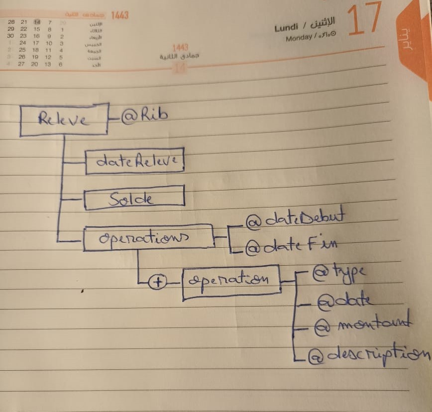
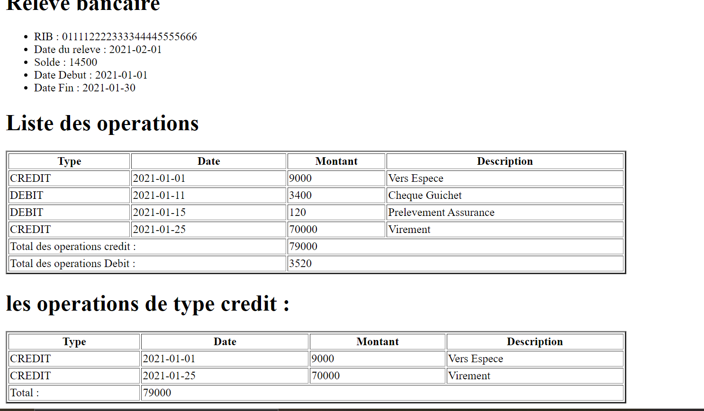
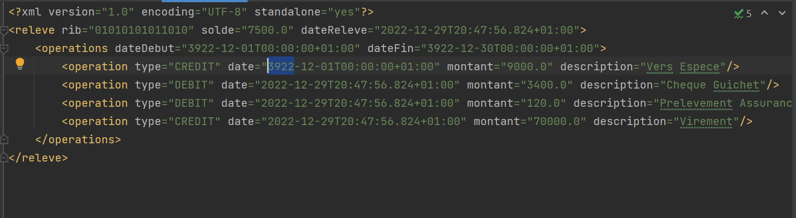
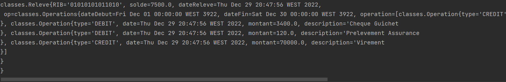
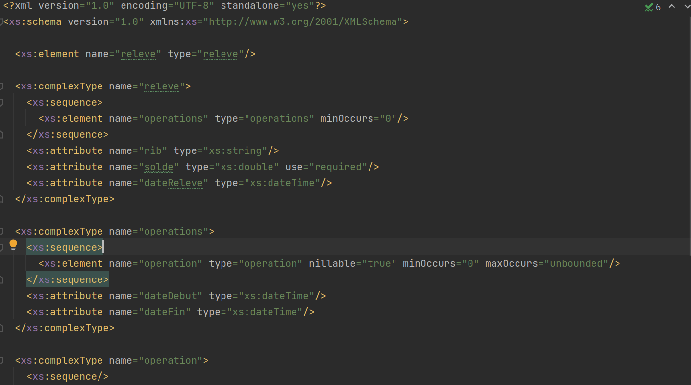
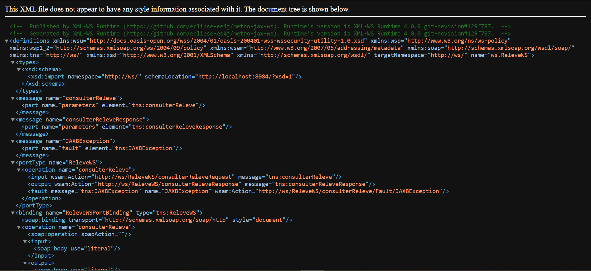
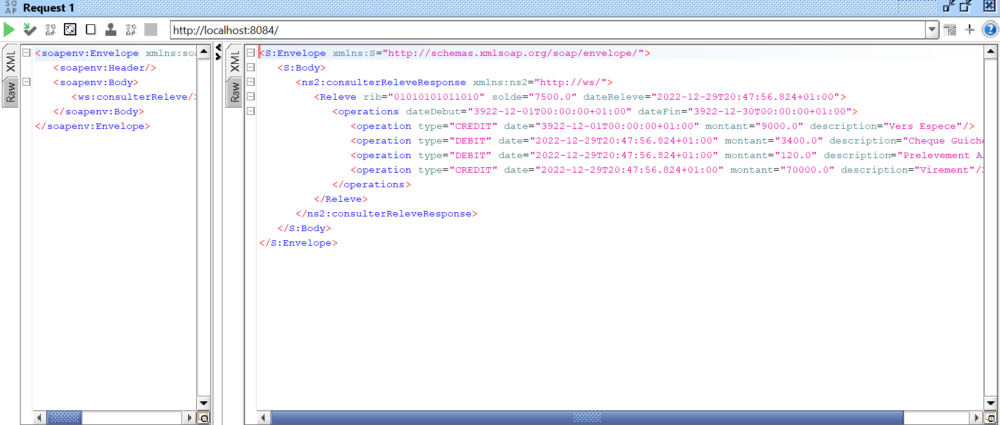
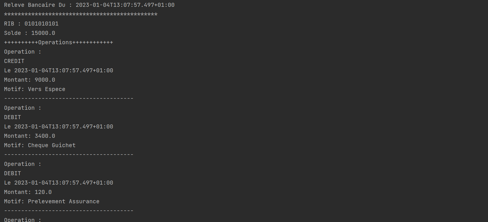

# TechnologieXML_WS
<h2> A. Partie Technologie XML </h2>
<h3> 1.Arbre XML </h3>

<h3> 4 & 5 :Liste des operations avec XSL </h3>

<h2> B. Partie Mapping Objet XML avec Jax Binding </h2>
<h3> Serialisation dans un fichier XML </h3>

<h3> Deserialisation  </h3>

<h3> Generalisation du Schema XML a partir d'un fichier XML </h3>

<h2> C. Partie Web Service SOAP WSDL avec JaxWS </h2>
<h3> WSDL du WebService </h3>

<h3> Test des methodes de Web Service avec SOAPUI </h3>

<h3> Client SOAP Java </h3>

